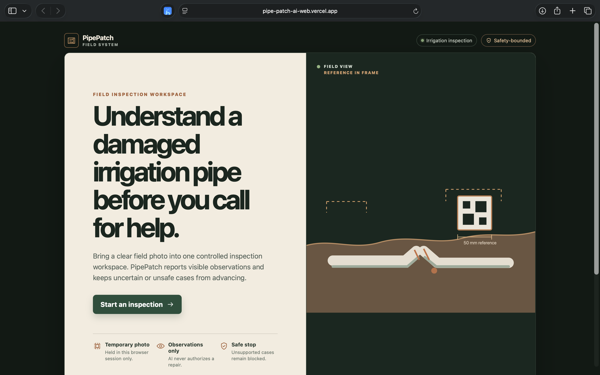
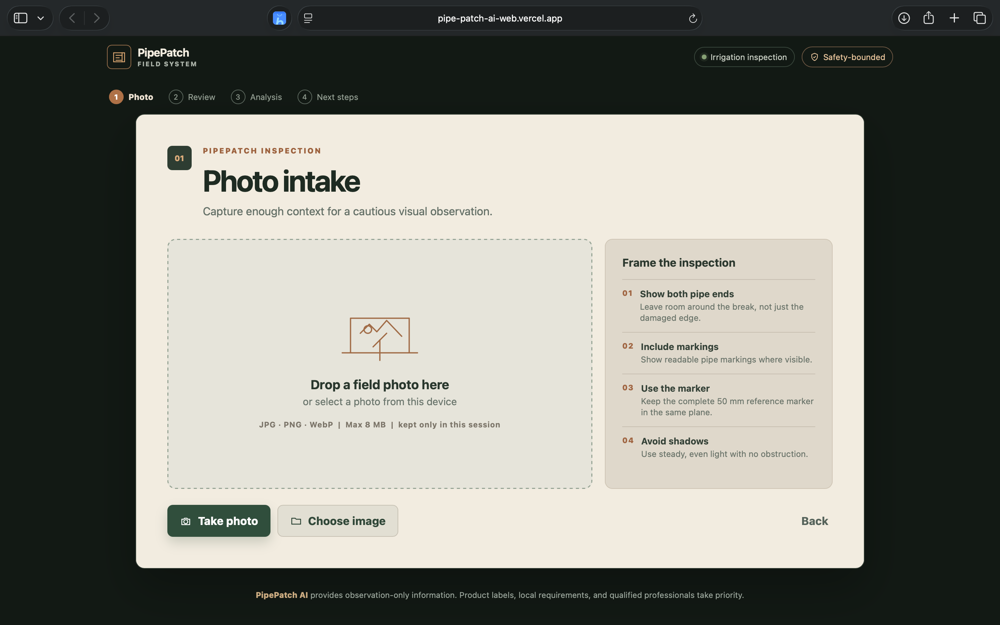
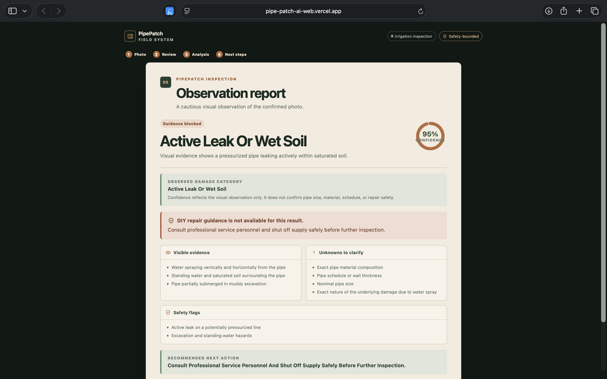
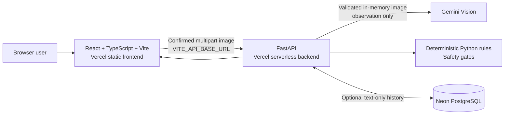

# PipePatch AI

**A safety-bounded web workspace for understanding visible irrigation-pipe damage before deciding what to do next.**

[](https://pipe-patch-ai-web.vercel.app)
[](https://pipe-patch-ai-tan.vercel.app/docs)


## The problem

Outdoor irrigation-pipe damage is easy to misidentify from a single photo, and a confident-looking answer can be unsafe. PipePatch AI is designed to stop before guessing: Gemini extracts visual observations, while deterministic Python rules retain authority over every safety-sensitive decision.

The supported DIY boundary is intentionally narrow: a confirmed outdoor Schedule-40 PVC **clean transverse cut** on a straight, accessible section, with an explicitly confirmed 1/2 in, 3/4 in, or 1 in nominal size. Uncertain, mock, hazardous, or unsupported cases are blocked.

## Live browser workflow

The deployed web experience currently provides this complete browser flow:

1. Start a field inspection and follow capture guidance.
2. Take a browser camera photo or choose a JPG, PNG, or WebP file (up to 8 MB).
3. Review the original image before it is sent.
4. Receive a structured Gemini observation: damage category, confidence, evidence, unknowns, safety flags, and next action.
5. Stop safely when the result is mock, uncertain, unsupported, or not a clean transverse cut.

The active image is held only in browser memory, sent only after confirmation, and cleared when the user replaces, ends, or resets the inspection.

## Screenshots

<p align="center">
  
  
  
</p>

<p align="center"><em>Field-inspection home · photo review before upload · structured, safety-bounded analysis report</em></p>

## Key features

- Responsive React/TypeScript/Vite interface for desktop and mobile browsers.
- User-initiated browser camera capture, desktop drag-and-drop, and file selection.
- Explicit JPG, PNG, and WebP validation with an 8 MB limit; no aspect-ratio requirement.
- Multipart uploads to FastAPI without manually setting a multipart boundary.
- Live Gemini vision observations or deterministic mock mode for offline demonstrations and tests.
- Typed API contracts, duplicate-submit protection, cancellation, retry messaging, and stale-response guards.
- Versioned damage taxonomy with clear refusal handling for non-clean-cut categories.
- Optional backend capabilities for calibration, assisted measurement, deterministic assessment, guidance, parts estimates, supplier lookup, and text-only account history.

### What is available in the deployed web UI today

The public browser interface currently exposes the photo-to-analysis workflow above. The backend also contains calibration, measurement, deterministic repair assessment/guidance, parts, supplier, and optional account/history APIs, but those later stages are **not presented as completed user flows in the deployed web interface**. They must not be interpreted as available browser features.

## Safety and privacy boundaries

- Gemini is observation-only. It does not authorize repairs, choose parts, or provide supplier advice.
- Deterministic Python rules fail closed whenever observations, confirmation, calibration, measurement, or safety context is missing or conflicting.
- The client never stores photos, EXIF, location data, provider prompts, API keys, or raw provider payloads.
- The backend validates uploads in memory and does not retain image bytes or filenames.
- Optional repair history is opt-in and text-only. It excludes images, image metadata, locations, quotes, prices, supplier searches, and raw AI content.
- Product labels, local regulations, and qualified professionals take priority over all app content.

## Architecture



The frontend and backend are separate Vercel projects. CORS accepts only explicitly configured browser origins, and client-side provider calls are not used.

## Technology stack

| Layer | Technology | Responsibility |
| --- | --- | --- |
| Web client | React, TypeScript, Vite | Responsive browser UI and ephemeral image selection |
| API | Python, FastAPI, Pydantic | Typed contracts, upload validation, safety orchestration |
| Vision | Google GenAI Gemini | Structured visual observations only |
| Deterministic logic | Python, OpenCV | Calibration, assisted measurement, taxonomy, and safety gates |
| Persistence | SQLAlchemy, Alembic, Neon PostgreSQL | Optional accounts and text-only repair history |
| Deployment | Vercel | Separate static frontend and serverless backend projects |

## Local setup

### 1. Run the backend

```sh
cd backend
cp .env.example .env
python3 -m venv .venv
source .venv/bin/activate
python -m pip install --upgrade pip
python -m pip install -e '.[dev]'
uvicorn app.main:app --reload --env-file .env
```

The safe default is `ANALYSIS_MODE=mock`. For a live demo, set `ANALYSIS_MODE=gemini`, `GEMINI_MODEL`, and `GEMINI_API_KEY` only in `backend/.env` or your server-side secret manager.

### 2. Run the web client

```sh
cd web
cp .env.example .env
# Set VITE_API_BASE_URL=http://127.0.0.1:8000
npm ci
npm run dev
```

`VITE_API_BASE_URL` is the sole public build-time variable. It may contain the API origin, but never a Gemini key, database URL, JWT secret, or other credential.

## Deployment

Deploy as two Vercel projects:

1. **Backend:** use `backend/` as the Vercel root directory. Configure `ANALYSIS_MODE`, `GEMINI_API_KEY`, optional `AUTH_ENABLED`, `DATABASE_URL`, and `JWT_SECRET_KEY` as Vercel secrets/settings. Run Alembic manually against Neon before the first deployment; never migrate at import time or per request.
2. **Frontend:** use `web/` as the Vercel root directory. Set only `VITE_API_BASE_URL` to the deployed backend origin.
3. Add the exact frontend origin to backend `ALLOWED_ORIGINS`; never use wildcard CORS.

See the [deployment runbook](docs/deployment-runbook.md) for the environment checklist, Neon migration guidance, verification, rollback, and Vercel Hobby constraints.

## Testing and quality checks

```sh
cd web
npm run lint
npm run typecheck
npm test
npm run build

cd ../backend
.venv/bin/python -m pytest
.venv/bin/python -m ruff check .
.venv/bin/python -m mypy app
```

The repository includes focused tests for image validation, multipart requests, stale/cancelled browser operations, backend upload validation, Gemini error mapping, deterministic safety rules, calibration/measurement, taxonomy evaluation, auth/history, and Vercel route handling.

## Current limitations and future scope

- The deployed browser UI stops after structured visual analysis; later backend stages are not yet available as public browser flows.
- The supported repair boundary is intentionally limited and must not be generalized to fittings, branches, valves, unknown lines, household plumbing, gas, sewer, electrical conduit, or non-PVC materials.
- Calibration and assisted measurement are estimates, not automatic authorization or a substitute for physical verification.
- Retail inventory, price, stock, compatibility, and supplier availability are never claimed as live facts.
- Any future dataset must use explicit consent, de-identification, independent review, and storage outside Git. Synthetic evaluation tooling is present, but no real-world accuracy claim is made.

## Project materials

- [Product specification](docs/product-specification.md)
- [Final project report](docs/final-project-report.md)
- [Demo script](docs/demo-script.md)
- [Privacy and optional accounts](docs/privacy-and-auth.md)
- [Dataset card](docs/dataset-card.md)
- [Printable 50 mm ArUco marker card](docs/assets/pipepatch-aruco-marker-23-50mm.svg)
